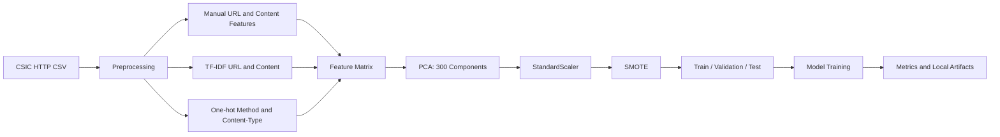

# Web Vulnerabilities Detection

Machine learning pipeline for detecting malicious HTTP requests in the CSIC 2010 web attack dataset.

The project builds request-level features from HTTP traffic, trains multiple classical ML models, and compares them with Accuracy, Precision, Recall, F1-Score, ROC-AUC, and Log Loss.

## Dataset

The repository keeps the raw CSIC dataset in `data/csic_database.csv`.

| Class | Meaning | Count |
|---:|---|---:|
| 0 | Normal request | 36,000 |
| 1 | Attack request | 25,065 |
|  | Total | 61,065 |

## Pipeline



Main workflow:

1. Load HTTP request records from `data/csic_database.csv`.
2. Clean missing values and normalize request fields.
3. Extract URL/content statistics and suspicious keyword counts.
4. Vectorize URL and content text with TF-IDF.
5. One-hot encode HTTP method and content type.
6. Reduce dimensionality with PCA.
7. Scale features and rebalance classes with SMOTE.
8. Split data into train, validation, and test sets.
9. Train and evaluate the configured models.

Approximate split used in `final.ipynb`:

| Split | Ratio |
|---|---:|
| Train | 70% |
| Validation | 10% |
| Test | 20% |

## Repository Structure

This tree lists only files intended to be committed. Generated arrays, reports, and model artifacts are ignored by git.

```text
WebVulnerabilities/
|-- .gitignore
|-- README.md
|-- requirement.txt
|-- final.ipynb
|-- config_module/
|   |-- config.py
|   `-- config.json
|-- data/
|   |-- csic_database.csv
|   `-- raw_data.py
|-- models/
|   |-- train_model.py
|   `-- evaluate_models.py
|-- preprocessing/
|   |-- preprocessing.py
|   |-- xml_preprocessing.py
|   `-- ppc.ipynb
|-- features/
|   `-- feature.py
|-- inference/
|   `-- inference.py
`-- utils/
    `-- utils.py
```

## Installation

Use Python 3.10 or newer.

```bash
python -m pip install -r requirement.txt
```

If Jupyter is not installed:

```bash
python -m pip install notebook ipykernel
```

Quick import check:

```bash
python -c "import pandas, numpy, sklearn, xgboost, seaborn, imblearn; import preprocessing.preprocessing; import models.train_model; print('OK')"
```

## Running The Notebook

Open the main notebook:

```bash
jupyter notebook final.ipynb
```

Then run the cells from top to bottom.

The notebook generates local files such as:

| Output | Purpose | Git status |
|---|---|---|
| `data/X_train.npy`, `data/X_val.npy`, `data/X_test.npy` | Feature arrays | Ignored |
| `data/y_train.npy`, `data/y_val.npy`, `data/y_test.npy` | Label arrays | Ignored |
| `dataset_with_features.csv` | Feature inspection export | Ignored |
| `model_results.csv` | Evaluation metrics | Ignored |
| `*.pkl` | Trained model artifacts | Ignored |

KNN and Linear SVC can take a long time on the full dataset. KNN is especially expensive during prediction.

## Models

| Model | Local artifact | Notes |
|---|---|---|
| Naive Bayes | `naive_bayes_model.pkl` | Fast baseline |
| Decision Tree | `Decision_tree_model.pkl` | GridSearchCV tuned |
| Random Forest | `random_forest_model.pkl` | Configured, artifact not currently present locally |
| Random Forest Grids | `random_forest_grids.pkl` | GridSearchCV tuned |
| KNN | `knn.pkl` | Strong score, slow prediction |
| Linear SVC | `linearsvc.pkl` | Calibrated for probability output |
| XGBoost | `xgboost.pkl` | Best overall local benchmark |

Model names, artifact paths, and result paths are configured in `config_module/config.json`.

## Latest Local Benchmark

The table below summarizes the latest local test-set metrics from `model_results.csv`.

| Model | Accuracy | Precision | Recall | F1-Score | ROC-AUC | Log Loss | Train Time (s) | Predict Time (s) |
|---|---:|---:|---:|---:|---:|---:|---:|---:|
| XGBoost | **0.9643** | **0.9544** | 0.9748 | **0.9645** | **0.9968** | **0.0734** | 82.95 | 0.16 |
| KNN | 0.9554 | 0.9452 | 0.9662 | 0.9556 | 0.9828 | 0.5596 | 435.66 | 180.25 |
| Linear SVC | 0.9451 | 0.9535 | 0.9352 | 0.9443 | 0.9894 | 0.1296 | 330.23 | 0.11 |
| Random Forest Grids | 0.9396 | 0.8974 | **0.9919** | 0.9423 | 0.9941 | 0.1263 | 108.90 | 0.15 |
| Decision Tree | 0.9407 | 0.9394 | 0.9415 | 0.9404 | 0.9427 | 2.0565 | 185.42 | 0.02 |
| Naive Bayes | 0.8049 | 0.8447 | 0.7445 | 0.7915 | 0.9044 | 6.7704 | 2.10 | 0.18 |

Key takeaways:

- XGBoost is the best overall model by Accuracy, Precision, F1-Score, ROC-AUC, and Log Loss.
- Random Forest Grids has the highest Recall, which is useful when missed attacks are more costly than false positives.
- KNN has a strong score but very slow prediction time.
- Naive Bayes is the fastest baseline but has the weakest score.

## Configuration

Important values in `config_module/config.py`:

| Parameter | Value |
|---|---:|
| `MAX_FEATURE` | 1000 |
| `PCA_COMPONENT` | 300 |
| `RANDOM_STATE` | 42 |
| `TEST_SIZE_1` | 0.3 |
| `TEST_SIZE_2` | 0.67 |
| `N_JOBS` | 2 |
| `CV` | 3 |

Model-specific hyperparameter grids are also defined in `config_module/config.py`.

## Git Policy

The `.gitignore` keeps the repository focused on code, configuration, documentation, notebooks, and the raw dataset.

Ignored local files include:

- Python caches and local virtual environments.
- Local `.env` files.
- Jupyter checkpoints.
- Trained model artifacts: `*.pkl`, `*.joblib`, `*.sav`.
- Generated arrays and reports: `data/*.npy`, `dataset_with_features.csv`, `model_results.csv`.
- Parsed request exports: `data/parsed_requests_*.csv`.

Before committing, check:

```bash
git status --short
```

If a generated file was already tracked before `.gitignore` was added, remove it from the git index with:

```bash
git rm --cached <path>
```

## Limitations

- The main workflow is currently notebook-based; there is no CLI training entrypoint yet.
- There is no CI/CD workflow yet.
- The standalone `random_forest_model.pkl` artifact is not currently available locally.
- Pickle artifacts should be loaded with a compatible `scikit-learn` version.
- `preprocessing/xml_preprocessing.py` contains a local machine path and should be parameterized before reuse.

## Next Steps

- Move the notebook workflow into a reproducible CLI training pipeline.
- Add inference logic in `inference/inference.py`.
- Persist the TF-IDF vectorizers, PCA object, and scaler for consistent inference.
- Add lightweight tests for imports, config validation, preprocessing, and model smoke prediction.
- Add a CI workflow for import checks and a small sample pipeline run.
